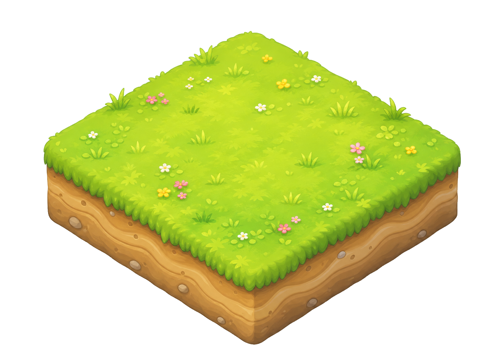
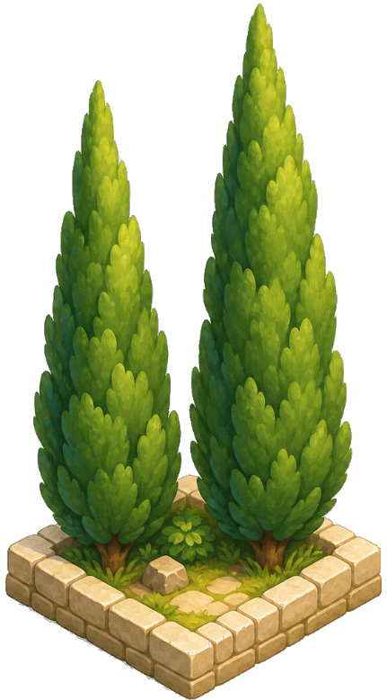

# Mykonos Island Voxels

这是一个运行在浏览器里的等距视角岛屿搭建器，呈现出米科诺斯岛那种柔和、被阳光漂白过的地中海气质：钴蓝色圆顶落在白墙之上，三角梅从石墙边垂下，橄榄树、风车、狭窄的鹅卵石小径，以及一片可以用点击雕刻出来的海。

它是一个小巧、自包含的创作玩具：在 14×14 的网格上放下方块，一座迷你村庄就在你眼前慢慢成形。这里没有目标、没有资源刷取、没有分数，只有像拼图一样不断摆放、调整，直到画面看起来恰到好处的乐趣。

---
## 替图
这里先举例 地形与柏树逻辑：

地形：


grass.png 是 1323 x 954，项目不会把这张大图原样铺到地面上。grass 在 src/assets/assetManifest.js 里被标记为 tileLike: true，加载时会走地形瓦片处理逻辑：


- 1.从图片里识别顶部菱形区域
- 2.把这个菱形缩放成每个地块的尺寸
- 3.项目每个地块实际只有 64 x 32 像素，配置在 src/config.js
- 4.所以一张很大的复杂图片会被压缩到一个很小的菱形格子里，细节就会糊。
简单说：grass.png 不是用来放“一整块大草地地图”的，它更适合放“单个可重复铺地的草地小瓦片”。

<span style=" font-weight: bold;">这张新图如果是那种很多小方块组成的大地块，放进去后每个格子都会把整张图缩成 64 x 32，自然会变糊。</span>

<span style="color: red; font-weight: bold;">更适合的素材应该是：只画一个单元格大小的草地方块，纹理简单、边缘清晰、不要包含太多小格子细节。</span>

给设计师可以这样表述：
“请按现有素材做同尺寸透明 PNG。风格要童话卡通、圆润、柔和、可爱，不要像素块、不要真实照片、不要背景、不要文字水印。保持原素材的视角、占地比例和底部锚点位置。”
这个项目的素材规则核心是：
- src/assets/assetManifest.js 是素材总表。
- id 默认对应 assets/<id>.png，比如 cypress 对应 assets/cypress.png。
- footprint: { w, d } 表示占几个地面格子。cypress 是 { w: 1, d: 1 }。
- sizeScale 表示显示时占单格宽度的比例。cypress 是 0.65，所以它虽然图片很高，但底部宽度只占一个格子的 65% 左右。
- terrain 类，比如 grass，会被压成每格 64 x 32 的地面瓦片，所以要画“单个可重复地块”，不要画整张大场景。
- object 类，比如 cypress、房子、道具，会作为独立 PNG 放在格子上。设计师最好直接沿用原图尺寸和透明边距。



针对 cypress 的设计要求可以写成：

文件：assets/cypress.png

尺寸：431 x 778 px

格式：PNG，透明背景

占格：1 x 1

显示比例：sizeScale 0.65

视角：等距 3/4 俯视

内容：两棵柏树 + 小方形底座

风格：童话卡通、圆润、柔和、可爱、非像素风

要求：保持底座在画面底部居中，不要白底/棋盘格背景，不要阴影背景，不要文字水印

<span style="color: red;">最稳妥的协作方式：让设计师打开现有 assets/*.png 当模板，直接在同尺寸画布里重画，并导出透明 PNG。</span>

---

## 功能

- **点击即可建造的等距网格。** 从右侧素材面板选择一个素材，点击格子，它就会带着弹性的放置动画跳入场景。
- **一键“铺满草地”。** 快速给整座岛铺上草地，几秒钟内就能开始布置。
- **75+ 个绘本风素材。** 素材按地形、自然、道具、水体和建筑分类，包括礼拜堂、风车、两层别墅、柏树、橄榄树、龙舌兰、水井、灯笼、栅栏、桥梁等。
- **优先适配触控的移动端界面。** 点按放置、长按擦除、拖动刷涂、双指缩放和平移。布局会从桌面端一路适配到小屏手机，并为 iPhone 刘海屏保留安全区域。
- **高保真素材管线。** 源 PNG 在加载时以 6× 显示分辨率预渲染，烘焙进高 DPI 缓存图层，再逐帧合成，让画布在任何缩放比例和屏幕密度下都保持清晰。
- **自动保存。** 你的岛屿会保存到 `localStorage`，下次访问时自动重新加载。
- **克制的声音设计。** 水、石头、木头、小型植被、大型植被和 UI 点击都有不同的放置音效，并对重叠播放做了防抖，避免刷涂时音频过载。
- **纯 ES modules。** 没有打包器、没有转译器、没有运行时 `node_modules`，打开 `index.html` 就能运行。


## 操作

### 鼠标 + 键盘

| 输入 | 动作 |
|---|---|
| 点击 | 放置当前选中的素材 |
| 拖动 | 跨格子连续刷涂放置 |
| 右键点击 | 擦除地块 |
| 右键拖动 | 连续刷涂擦除 |
| Shift + 拖动 | 平移相机 |
| 滚轮 | 缩放 |
| `H` / `V` | 翻转放置预览 |
| `E` | 切换擦除模式 |
| `G` | 切换网格叠加层 |
| `1`–`5` | 切换素材分类 |
| `S` / `R` | 保存 / 重置 |

### 触控

| 手势 | 动作 |
|---|---|
| 点按 | 放置当前选中的素材 |
| 拖动 | 跨格子连续刷涂放置 |
| 长按（约 420 ms） | 擦除手指下方的地块 |
| 双指捏合 | 缩放 |
| 双指拖动 | 平移相机 |

## 本地运行

这个项目由普通的 HTML / CSS / ES modules 组成，开发时不需要构建步骤。由于浏览器不会从 `file://` URL 加载 ES modules，你需要通过 HTTP 提供文件。选择下面任意一种方式即可：

```bash
# 在项目根目录执行：
python3 -m http.server 8000
```

然后打开 <http://localhost:8000>。

## 部署（仅供测试）

网站部署在 Netlify 上。仓库里的 `netlify.toml` 和 `netlify-build.mjs` 会生成一个干净的 `dist/` 文件夹，其中只包含运行时文件（不包含设计参考、不包含 `.DS_Store`、不包含重复的 `.webp` 文件），并附带合适的缓存头（素材使用 immutable，HTML/CSS/JS 使用 must-revalidate）。

```bash
netlify deploy --prod
```

## 项目结构

```
.
├── index.html               # 入口文件
├── styles.css               # 全部 UI 样式（无框架）
├── src/
│   ├── main.js              # 启动、素材加载、初始场景
│   ├── config.js            # 网格尺寸、地块尺寸、素材面板、调试开关
│   ├── core/
│   │   ├── Game.js          # 游戏状态 + 工具分发
│   │   ├── Camera.js        # 平移 / 缩放 / 变更通知
│   │   ├── Renderer.js      # 分层画布缓存 + 动画
│   │   └── InputManager.js  # 鼠标 + 触控 + 键盘
│   ├── grid/
│   │   ├── IsoGrid.js       # 屏幕 ↔ 格子的坐标换算
│   │   └── TileMap.js       # 地形 + 对象、占用索引
│   ├── building/
│   │   └── PlacementSystem.js
│   ├── assets/
│   │   ├── assetManifest.js # 75+ 个素材定义
│   │   ├── assetLoader.js   # PNG → 显示画布 + 阴影画布
│   │   ├── imageToAsset.js  # 轮廓提取、锚点推断
│   │   └── voxelRenderer.js # PNG 缺失时的程序化兜底渲染
│   ├── ui/
│   │   ├── UIManager.js
│   │   ├── Toolbar.js
│   │   ├── AssetPalette.js
│   │   ├── HUD.js
│   │   └── Audio.js         # WebAudio 音频路由 + 防抖
│   └── persistence/
│       └── SaveSystem.js
├── assets/                  # PNG 素材包（预生成）
├── *.ogg                    # 放置 / UI 音效
├── netlify.toml
└── netlify-build.mjs
```

## 架构说明

如果你想改渲染器，有几个设计选择值得留意：

- **分层缓存渲染。** `Renderer.js` 维护四类缓存画布：屏幕空间的背景 + 暗角组合（窗口尺寸变化时重建）、世界空间的平台（网格尺寸变化时重建）、世界空间的地形层（地形版本计数变化时重建），以及世界空间的静态对象层（添加 / 移除时重建）。每一帧里，渲染器会合成这些缓存，并只额外覆盖当前正在播放动画的地块。空闲帧几乎没有额外开销。
- **高 DPI 缓存画布。** 缓存画布按 `world × CACHE_SCALE` 尺寸创建（普通屏幕 2×，retina 屏幕 3×），这样即使相机把它们放大，像素也能接近最终的屏幕分辨率。素材的 displayCanvas 会以最高 6× 参考尺寸预渲染，因此细节可以一路保留下来，不会在中间步骤变“糊”。
- **`TileMap` 中的空间占用索引。** 对象查找和空闲格检查是每个格子 O(1)，而不是在对象列表上做 O(N) 遍历。
- **脏标记渲染。** 相机、输入和工具状态切换会调用 `markDirty()`；当场景静止且没有待播放动画时，循环会提前退出。

## 贡献

欢迎提交 PR。请注意：

- 保持无框架：运行时不要引入打包器、转译器或 `node_modules`。
- 控制素材数量，并保持视觉风格一致（奶油白上的钴蓝色、柔和阴影、轻微弹性的运动）。
- 不要加入逐帧 `ctx.filter`、ImageBitmap 折腾，或任何会让复杂场景重新掉帧的东西。渲染器的缓存不变量是性能的关键支撑。

## 许可证

MIT，详见 [LICENSE](LICENSE)。

`assets/` 中的 PNG 素材包采用同一许可证发布，并为本项目生成。音频片段是单独制作的；如果需要署名，请查看文件元数据。
